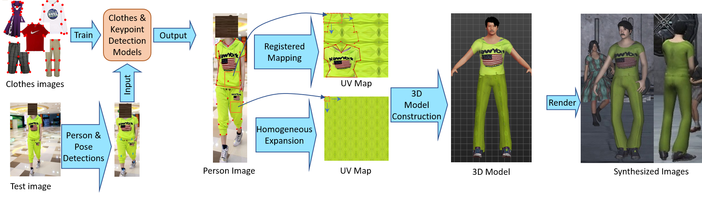

# Pipeline Guidance
This is the guiding document for the project in "[Cloning Outfits from Real-World Images to 3D Characters for Generalizable Person Re-Identification](https://arxiv.org/pdf/2204.02611.pdf)". 

Fig. 1. The proposed ClonedPerson pipeline, which automatically creates similarly dressed 3D characters from person images.

## Table of Contents

- [Pedestrian detection](#pedestrian-detection)
- [Person view qualification by pose detection](#pose-detection)
- [Clothes and keypoint detection](#clothes-detection)
- [Similarity-Diversity Expansion](#cluster)
- [Generate 3D characters](#characters)
- [Export 3D characters](#characters)
- [Unity3D Simulation and Rendering](#rendering)
- [Image cropping.](#cropping)

## Pedestrian detection

1. run the command:
`
git clone https://github.com/Yanan-Wang-cs/ClonedPerson.git
cd ClonedPerson/pipeline
conda create -n clonedperson_1pede python=3.7
conda activate clonedperson_1pede
pip install -r 1Pedestron/pedestron.txt
`
2. Download the model [epoch_19.pth.stu](https://drive.google.com/file/d/1Cw9loOUBhLJ4HYcw298V3ozfxON3ZOFN/view?usp=sharing) and put it into the folder "1Pedestron/models_pretrained"
3. Put the image to be detected into the folder of the root directory. (eg img).
4. Modify demo.sh, the last two parameters are the test folder and the result folder respectively
5. run the command: "cd 1Pedestron && sh demo.sh && cd .."

### Person view qualification by pose detection

1. run the command:
`
conda create -n clonedperson_2pose python=3.7
conda activate clonedperson_2pose
pip install -r 2Pose/pose.txt
`
2. Download the model [hrnet_w48_coco_256x192-b9e0b3ab_20200708.pth](https://drive.google.com/file/d/1TpnPTXITd9q6Dz7xCDBvdgU7d-L55ndM/view?usp=sharing) and put it into the folder "2Pose/models"
3. Put the images in folder (eg img) in the same directory as mmpose
4. Modify demo.py, update the "imgFolder", "resultFolder", and "pointsFile"
5. run the command: "cd 2Pose && python demo.py && cd .."

### Clothes and keypoint detection

1. run the command:
`
conda create -n clonedperson_3clothes python=3.7
conda activate clonedperson_3clothes
pip install -r 3Clothes/clothes.txt
`
2. Download the model [epoch_12.pth](https://drive.google.com/file/d/14V2olxULzVo5b7iUAip3t8UQqjvM8E6M/view?usp=sharing) and put it into the folder "3Clothes/mmdetection/deppFashion2_multigpu"
3. Download the folder [snapshots](https://drive.google.com/drive/folders/17Qbkc0W3-0S_cMMkNvMWnWBEJ_tmJK8Y?usp=sharing) and put it into the folder "3Clothes/PIPNet_rmnb"
4. Put the images in folder (eg img) in the same directory as mmdetection
5. Modify demo.py, update the "imgFolder", "resultFolder", and "pointsFile"
6. run the command: "cd 3Clothes && python demo.py && cd .."

### Similarity-Diversity Expansion

`
conda create -n clonedperson_4cluster python=3.7
conda activate clonedperson_4cluster
pip install -r 4cluster/cluster.txt
`
2. Download the model [checkpoint.pth.tar](https://drive.google.com/file/d/1YH9k_xLRCfPv5EQcyLQWBE6xuUytk0Wa/view?usp=sharing) and put it into the folder "4cluster/QAConv"
3. Put the images into the folder "4cluster/QAConv/Data/cluster/img"
4. Modify demo.sh, update the "save_data_path" and "eps".
5. run the command: "cd 4cluster && sh demo.sh && cd .."

## Generate 3D characters

1. Download accessories (e.g., hair, beard, shoes, and skin) according to the "5characters/accessories/download.txt". In each link, download all files including *.mhclo, *.obj, *.mhmat, *.thumb, and *.png or *.jpg
2. Download clothes according to the "5characters/models/download.txt", the data format is: "folderName, downloadLink". Put these folders under "models"
3. If there are some clothes in step2 failed to download, delete the corresponding lines in "5characters/Resources/model.csv". The data format in model.csv: "folderName, clothType, pointsPosition, image corresponding point, UV map corresponding point, 50×50 block maximum mapping area, Pants area in full body suit"
4. Put images and the label file in "5characters/Source/" as the example shows.
5. Download the model [checkpoint.pth.tar](https://drive.google.com/file/d/1YH9k_xLRCfPv5EQcyLQWBE6xuUytk0Wa/view?usp=sharing) and put it into the folder "5characters/"
6. run the command: "cd 5characters && sh demo.sh & cd .."
7. You could add accessories and clothes by downloading from the [community](http://www.makehumancommunity.org/content/user_contributed_assets.html).

### Export 3D characters

1. Install MakeHuman.
2. Put the accessories and generated characters in to MakeHuman's clothes folder. e.g., "~/Documents/makehuman/v1py3/data/clothes".
3. Put skins in to MakeHuman's skin folder. e.g., "~/Documents/makehuman/v1py3/data/skins".
4. Modify the characterPath (e.g., '/home/exp/Documents/makehuman/v1py3/models/') and character Id range in "6export/guiexport.py".
5. Use "6export/guiexport.py" replace the file in "MakeHuman installation folder/makehuman/apps/gui/guiexport.py".
6. Start MakeHuman and choose "Files" tab to load a character. Then, click the "Export" tab and choose "filmbox(fbx)". Finally, click "Export" button.
7. Generated characters are saved in "Your characterPath/3D/" (e.g., '/home/exp/Documents/makehuman/v1py3/models/3D')

### Unity3D Simulation and Rendering

1. Download Unity3D and create an empty 3D project(e.g., Documents/UnityProject/).
2. Put the generated characters (e.g., '/home/exp/Documents/makehuman/v1py3/models/3D') into "Documents/UnityProject/Assets/Resources/" and wating for load. If "fix now" showed, choose it.
3. Select the characters in Resources (e.g., Resources/example/B630000-630002), then choose "Rig" tab and select "Humanoid" as Animation Type. After that, click "Apply" button.
4. Install Unity Recorder: Select "Window -> Package Manager", and click "Advanced" to choose "Show preview packages", and install "Unity Recorder"
5. Configure Unity Recorder: Window -> General -> Recorder -> Recorder Window
6. Import Package: demo and start recording.

### Crop dataset

1. Move the recording result (e.g., Recordings1_scene99) to the folder "8crop/Data".
2. Modify parameters in "8crop/crop.py", such as "framerate".
3. run the command: "cd 8crop && python crop.py && .."

